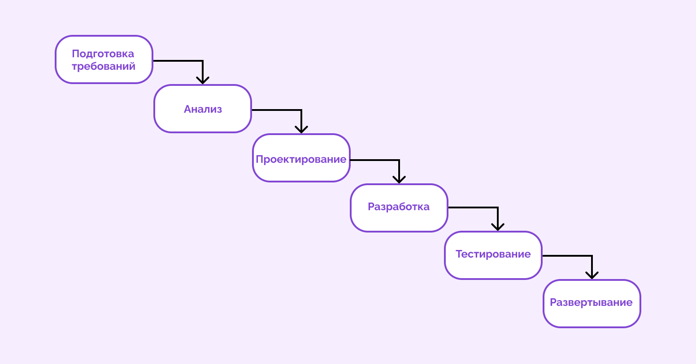
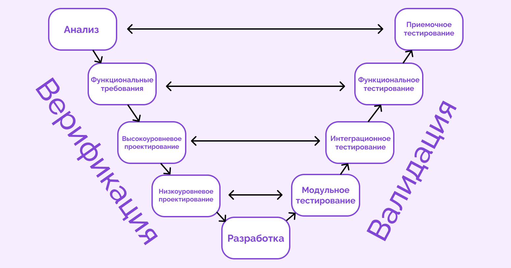
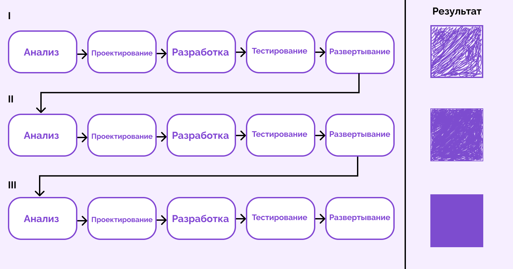
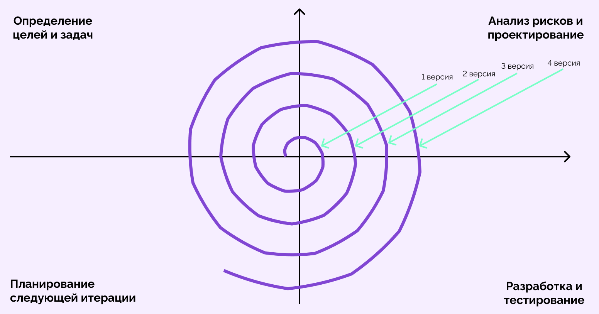

# Жизненный цикл разработки ПО (SDLC)

*Жизненный цикл — это путь, который проходит продукт: от момента задумки до вывода из эксплуатации (*смерти*)*

### Этапы ЖЦПО:
+ ### Планирование и анализ требований
      1. Описание задач, которые должен решать продукт;
      2. Опрос стейкхолдеров;
      3. Выявление аудитории продукта;
      4. Оценка ресурсов для реализации;
      5. Согласование критериев оценки;
+ ### Определение требований
        1.	Оценка рисков;
        2.	Выбор методологии работы;
        3.	Описание пользовательских сценариев;
+ ### Проектирование
    | Верхнеуровневое проектирование (High-Level Design) | Низкоуровневое проектирование (Low-Level Design) |
    | :--- | :--- |
    | Основные компоненты проектирования системы — модули, сервисы, подсистемы | Принцип работы отдельных компонентов системы |
    | Принцип взаимодействия этих компонентов между собой | Алгоритм, структуры данных и логика работы внутри каждого модуля |
    | Общая архитектура системы — клиент-серверная или микросервисы | Детали реализации — какие классы, методы или функции будут созданы |
    | Зависимость решения от других систем | Взаимодействие с базами данных, API или другими внешними системами |
    | Прототип интерфейса |  |

+ ### Разработка
+ ### Тестирование 
+ ### Развёртывание
+ ### Поддержка и сопровождение
+ ### «*Смерть*» ПО - вывод из эксплуатации

 

## Модели жизненного цикла ПО:

### *Каскадная (Водопадная) модель* 
 Каскадная модель устроена как классический последовательный процесс. Это значит, что движение происходит только вперед от одного этапа к следующему. При работе по каскадной модели на последнем этапе заказчик получает готовое решение, которое не требует доработок.

 Принцип простой, но строгий, поэтому некоторые считают его устаревшим. Однако он все еще подходит для некоторых проектов в самостоятельном виде или в сочетании с гибкими методиками. 
 
 

Плюсы:

Полное документирование каждого этапа до начала разработки;

Низкий риск ошибок за счет детальной документации;

Прозрачность процессов для заказчика — он знает, сколько времени уйдет на каждый этап.

Минусы:

Перед стартом нужно подготовить обширную техническую документацию, что занимает много времени;

Сложно учесть все требования до старта разработки;

Нет гибкости — если появились новые требования на этапе разработке, то откатить работу назад не получится;

Заказчик видит результат в конце разработки — если итог его не устроит, придется начинать сначала.

*V-образная модель* 

 

*Итеративная модель* 

 

*Инкрементная модель* 

 

*Спиральная модель* 

 

Agile -  
Scrum -  
Kanban - 

# Задачки: 
    - изучить md
    - Дописать лекцию ЖЦПО

># Не цитата дня
> я не знаю программирования и вообще ничего не знаю, но мне уже пора бы научится всякой всячине
>
> *- ЯПи*
